# Network Policy Architecture

Here is a clear breakdown of the Network Policy set up in `05-networkpolicy`.

```mermaid
graph TD
    %% Nodes
    subgraph Cluster["Kubernetes Cluster"]
        direction TB
        subgraph NS["Namespace: default"]
            
            %% Policy Definition
            NP("🛡️ NetworkPolicy: redis-network-policy")
            
            %% Pods
            TargetPod("🔴 Redis Pod (Target)<br/>[app: redis]")
            BlockedPod("⛔ Nginx/Hack (Blocked)<br/>[app: nginx]")
            AllowedPod("✅ Client Pod (Allowed)<br/>[role: known-redis-member]")

            %% Data Flow
            BlockedPod -- "❌ TCP 6379 (Blocked)" --> TargetPod
            AllowedPod -- "✅ TCP 6379 (Allowed)" --> TargetPod
        
        end
    end

    %% Styles
    classDef target fill:#ffdede,stroke:#ff0000,stroke-width:2px,color:black;
    classDef blocked fill:#f0f0f0,stroke:#666666,stroke-width:2px,color:#666666,stroke-dasharray: 5 5;
    classDef allowed fill:#e6fffa,stroke:#00b894,stroke-width:2px,color:black;
    classDef policy fill:#fff,stroke:#333,stroke-width:1px,stroke-dasharray: 5 5,color:black;

    class TargetPod target;
    class BlockedPod blocked;
    class AllowedPod allowed;
    class NP policy;

    %% Connections
    NP -.- TargetPod
    linkStyle 0 stroke:red,stroke-width:2px;
    linkStyle 1 stroke:green,stroke-width:2px;
```

## Breakdown
- **Target**: The Policy protects pods showing `app: redis`.
- **Rule**: It only accepts Ingress traffic on **TCP port 6379**.
- **Source**: Traffic is only allowed from pods labeled `role: known-redis-member`.
- **Result**: Even if the Nginx pod is in the same namespace, it cannot access Redis because it lacks the specific role label.
