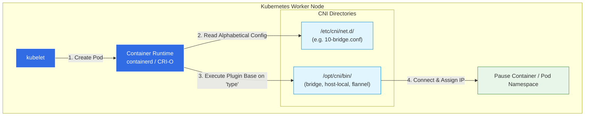

# CNI in Kubernetes: Configuration & Execution

In previous lectures, we learned that Kubernetes relies on the **Container Network Interface (CNI)** to build the bridge networks, create virtual cables (`veth` pairs), assign IPs, and set up routing between nodes. But *how* exactly does Kubernetes know which CNI plugin to use, and where are these plugins located?

---

## ⚙️ 1. Who Calls the CNI?

The CNI specification dictates that the **Container Runtime** is responsible for creating the network namespaces and then invoking the appropriate CNI plugin.

In a modern Kubernetes cluster, the container runtime is usually **containerd** or **CRI-O** (which replaced Docker). When the `kubelet` asks the runtime to spin up a new Pod (starting with the "Pause" container), the runtime is the component that actually executes the CNI plugin.

---

## 📁 2. The Two Critical CNI Directories

To configure and run CNI plugins, the container runtime looks in two very specific directories on the host node. You must memorize these paths for the CKA exam!

### 1. The Plugin Binaries: `/opt/cni/bin/`
This directory holds the actual executable files for the plugins. If you list the contents of this directory (`ls /opt/cni/bin/`), you will see the compiled binaries for:
*   Core plugins: `bridge`, `macvlan`, `ipvlan`, `loopback`
*   IPAM plugins: `host-local`, `dhcp`
*   Third-party plugins: `flannel`, `calico`, `weave-net`, etc.

### 2. The Configuration Files: `/etc/cni/net.d/`
This is where the container runtime looks to figure out *which* plugin to use. 

When you install a network addon like Flannel or Weave, it drops a configuration file into this directory (e.g., `10-bridge.conf` or `10-calico.conflist`). 

> [!IMPORTANT]
> **Alphabetical Priority**: If there are multiple configuration files in `/etc/cni/net.d/`, the container runtime will read them in **alphabetical order** and use the first one it finds.

---

## 📝 3. Anatomy of a CNI Configuration File

Let's look at the structure of a basic CNI configuration file (like `10-bridge.conf`). It is written in JSON format:

```json
{
    "cniVersion": "0.2.0",
    "name": "mynet",
    "type": "bridge",
    "bridge": "cni0",
    "isGateway": true,
    "ipMasq": true,
    "ipam": {
        "type": "host-local",
        "subnet": "10.244.0.0/16",
        "routes": [
            { "dst": "0.0.0.0/0" }
        ]
    }
}
```

### Breaking Down the Configuration:
*   **`type": "bridge"`**: Tells the runtime to execute the bridge binary located in `/opt/cni/bin/bridge`.
*   **`isGateway": true`**: Instructs the plugin to assign an IP address to the bridge interface itself so it can act as the default gateway for the Pods attached to it.
*   **`ipMasq": true`**: Tells the plugin to configure NAT (IP Masquerading) via iptables so Pods can reach external networks (like the internet).
*   **`ipam` (IP Address Management)**:
    *   **`type": "host-local"`**: Uses the `host-local` IPAM binary (also in `/opt/cni/bin/`) to manage IPs from a local file on this specific host, rather than an external `dhcp` server.
    *   **`subnet`**: The range of IP addresses to assign to containers on this node.
    *   **`routes`**: Any routes that need to be injected into the container's routing table.

---

## 🏛️ 4. Architecture Diagram: CNI Execution Flow



---

## 🚩 5. CKA Exam Tip

If you are asked to troubleshoot why Pods are not getting IP addresses or why a node shows as `NotReady` with a `NetworkPluginNotReady` error:
1. Check if the binaries exist in `/opt/cni/bin/`.
2. Check if a valid configuration file exists in `/etc/cni/net.d/`. If this folder is empty, the CNI plugin hasn't been installed yet!
