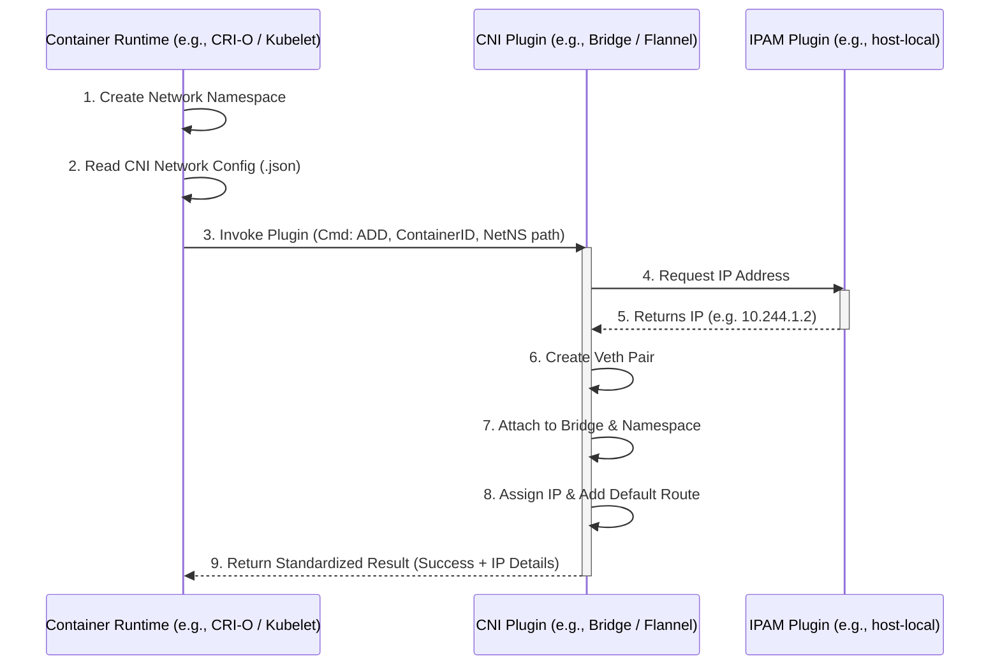

# Container Network Interface (CNI)

Throughout exploring Network Namespaces and Docker Networking, you've seen the same pattern repeated: creating namespaces, building virtual cables (veth pairs), attaching them to bridges, assigning IPs, and setting up NAT. 

Different container runtimes (like Kubernetes, rkt, Mesos) all need to solve these identical networking challenges. Instead of every platform writing their own custom code to do this, the industry agreed on a single, standardized approach.

This standard is the **Container Network Interface (CNI)**.

---

## 📜 1. What is CNI?

The CNI is a **set of standards and specifications**. It defines exactly how programs (plugins) should be written to configure container networking, and exactly how container runtimes should invoke those programs.

As long as a container runtime and a network plugin both adhere to the CNI standard, they can work together perfectly. You can swap out your network backend without changing your container runtime!

---

## 🤝 2. The Division of Responsibilities

The CNI specification clearly draws the line between what the runtime does and what the plugin does. Here is the workflow when a new container spins up:

### CNI Workflow Architecture

### The Container Runtime (e.g., Kubernetes) Must:
1.  **Create the Namespace**: Create a network namespace for the new container.
2.  **Define Networks**: Identify which networks the container must attach to using a JSON configuration file.
3.  **Invoke Plugins (ADD/DEL)**: Call the configured CNI plugin with the `ADD` command when a container is created, passing the Container ID and Namespace path. When the container stops, it must call the plugin with the `DEL` command to clean up.

### The CNI Plugin Must:
1.  **Support Commands**: Native support for the `ADD`, `DEL`, and `CHECK` command-line arguments.
2.  **Assign IP Addresses**: Typically handled by handing off to an IPAM (IP Address Management) plugin.
3.  **Create Interfaces & Routes**: Actually plumb the veth pairs into the namespace and set up the routing table so the container can reach others.
4.  **Return Standardized Results**: Output the success details (like the assigned IP and routes) in the format defined by the specification.

---

## 🧩 3. Types of CNI Plugins

There are dozens of CNI plugins. They generally fall into these categories:

### Core / Reference Plugins (Maintained by CNI)
*   `bridge`: Creates a bridge and adds the host and container to it.
*   `vlan`, `ipvlan`, `macvlan`: Advanced interface configurations.

### IPAM Plugins (IP Address Management)
*   `host-local`: Manages a local database of allocated IPs on that specific host.
*   `dhcp`: Runs a daemon to make DHCP requests on behalf of containers.

### Third-Party Plugins (The ones you use in Kubernetes!)
Organizations build powerful network fabrics that comply with CNI standards:
*   **Calico**
*   **Flannel**
*   **Weave Net**
*   **Cilium**

---

## 🐳 4. The Docker Exception (CNM vs CNI)

If you look closely at the list of CNI-compliant runtimes, **Docker is missing**. 

Docker does **not** implement CNI. Instead, Docker created its own competing standard called **CNM (Container Network Model)**.

Because of this, you cannot simply tell Docker to use Calico or Flannel natively. So, how does Kubernetes use Docker alongside CNI plugins?

### The Kubernetes Workaround:
1.  Kubernetes tells Docker to create the container with **no network configuration** (equivalent to `--network none`). Docker spins up the container in a completely isolated network namespace.
2.  Kubernetes then completely bypasses Docker's networking engine.
3.  Kubernetes manually invokes the configured **CNI Plugin**, passing it the namespace Docker just created.
4.  The CNI Plugin handles the bridges, IP assignments, and routes.

---

> [!IMPORTANT]
> **Important Note about CNI and the CKA Exam**
>
> In upcoming labs, you will work with Network Addons (like installing a weave-net, calico, or flannel plugin into a cluster). 
> 
> In the real CKA exam, **the documentation currently does not contain a direct reference to the exact command to be used to deploy a third-party network addon.** This has been intentionally done to keep the content in the Kubernetes documentation vendor-neutral (the official docs only link to third-party vendor sites or GitHub repositories, which you cannot access during the exam).
>
> **The Golden Rule for the Exam**: For any question that requires you to deploy a network addon, unless specifically directed to use a certain one, you may use any of the solutions. **All essential CNI deployment details (like the exact `kubectl apply -f <url>` command) will be explicitly provided to you within the exam question itself.**
