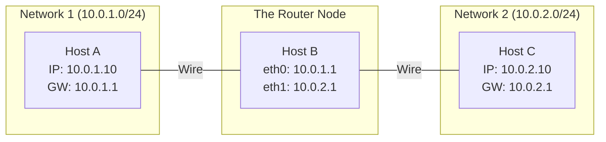
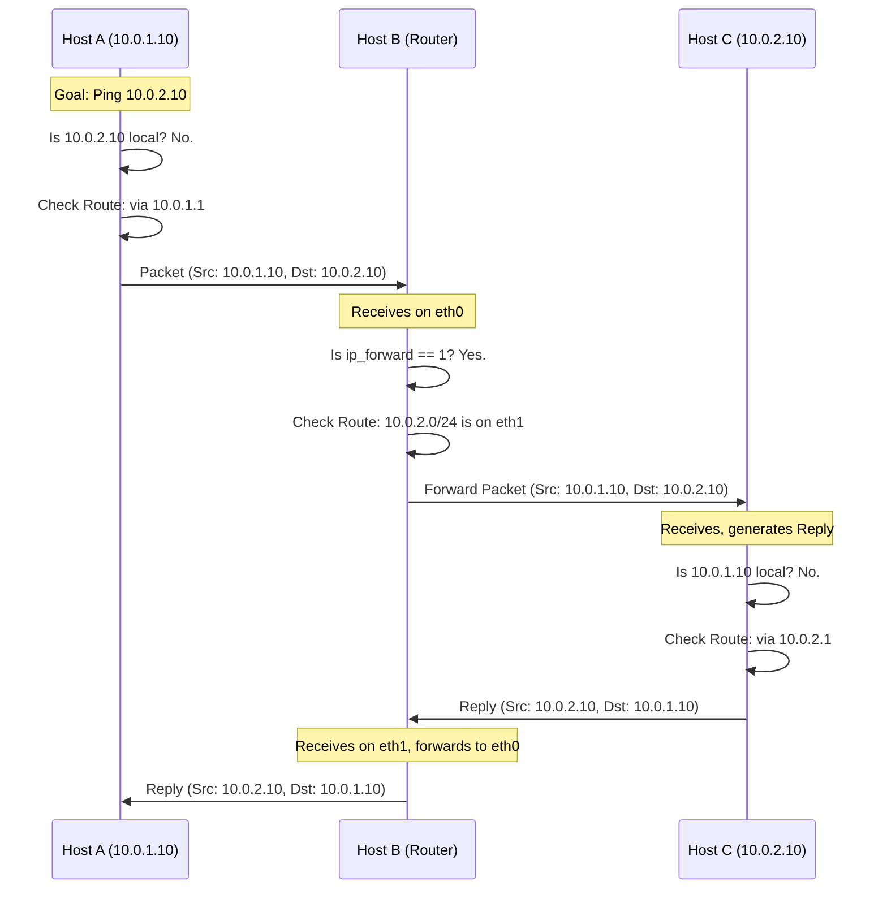

# IP Forwarding & Multi-Host Routing

In a multi-node Kubernetes cluster, nodes must act as routers to move traffic between Pods on different hosts. This requires enabling **IP Forwarding** at the Linux kernel level.

---

## 🚦 1. What is `ip_forward`?

By default, a Linux host act as an "endpoint." If it receives a packet that isn't addressed to one of its own IP addresses, it drops it. 

To make a Linux host act as a **Router**, you must enable the `ip_forward` setting.

### Checking the current state:
```bash
cat /proc/sys/net/ipv4/ip_forward
# 0 = Disabled (Default)
# 1 = Enabled
```

### Enabling it (Temporarily):
```bash
echo 1 > /proc/sys/net/ipv4/ip_forward
```

### Enabling it (Permanently):
To make the change survive a reboot, you must edit `/etc/sysctl.conf`. Typical Kubernetes prerequisites include these three lines:

```text
# Enable IPv4 Forwarding
net.ipv4.ip_forward = 1

# Required if using a bridge-based CNI (like Flannel or Weave)
# Ensures bridge traffic is processed by iptables
net.bridge.bridge-nf-call-iptables = 1
net.bridge.bridge-nf-call-ip6tables = 1
```

**Apply the changes immediately:**
```bash
sysctl -p
```

---

## 🗺️ 2. Scenario: Routing Among Three Hosts

Imagine we have three Linux hosts. **Host B** acts as a bridge/router between **Host A** and **Host C**.

### The Network Topology


### The Packet Flow (Logic)


---

## 🛠️ 3. Step-by-Step Configuration

If **Host A** wants to ping **Host C**, here is what must happen:

### Step 1: Enable Forwarding on Host B
Without this, Host B will receive the packet from A but refuse to pass it to C.
```bash
# On Host B
echo 1 > /proc/sys/net/ipv4/ip_forward
```

### Step 2: Add Route on Host A
Host A needs to know that to reach the `10.0.2.0/24` network, it must go through **Host B**.
```bash
# On Host A
ip route add 10.0.2.0/24 via 10.0.1.1
```

### Step 3: Add Route on Host C (For the Return Trip!)
Routing must be bi-directional. Host C needs to know how to get back to **Host A**.
```bash
# On Host C
ip route add 10.0.1.0/24 via 10.0.2.1
```

---

## 🚩 4. Relevance to Kubernetes

In a Kubernetes cluster (e.g., using **Kubenet** or **Calico**):
1.  **IP Forwarding**: Must be enabled on every worker node so the node can forward traffic into the Pods (which live in a different network namespace).
2.  **Routing Table**: The CNI plugin automatically manages these `ip route` entries so that every node knows which "Gateway" (other node) to use to reach a specific Pod's IP.

---

> [!CAUTION]
> **Firewall Trap**: Even if `ip_forward` is enabled and routes are correct, Linux **iptables** or **nftables** might still block the traffic. In Kubernetes, the CNI often adds `FORWARD` chain rules to allow this traffic.
> `iptables -P FORWARD ACCEPT` (Global allow - use with caution!)
