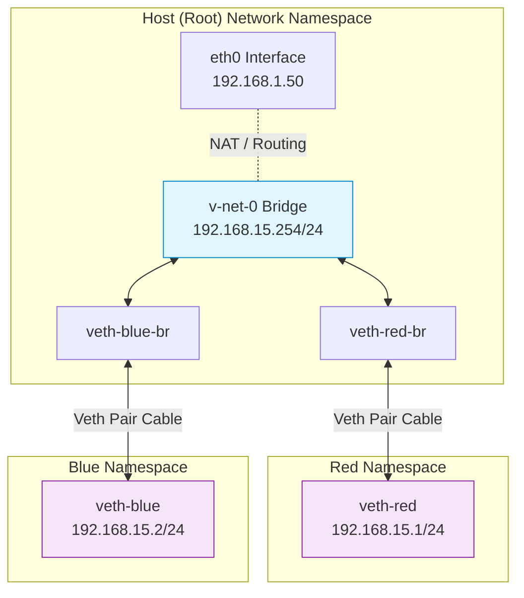

# Network Namespaces: The Magic of Isolation

In Linux, a **Network Namespace (netns)** is like a private copy of the entire network stack—interfaces, routing tables, and firewall rules. This is exactly how Kubernetes keeps one Pod's network completely separate from another.

---

## 🏗️ 1. Why Namespaces?

Without namespaces, every process on a server would share the same `eth0` interface and port list. If two apps wanted to listen on port 80, only one would win. 

With namespaces, each Pod thinks it has its own private `localhost` and its own private IP address, completely isolated from the host.

---

## 🛠️ 2. Working with Namespaces (Manual)

You can experiment with this on any Linux server using the `ip netns` command.

### Create a Namespace
```bash
ip netns add red
ip netns add blue

# List the existing network namespaces
ip netns
```

### How to "Hide" `eth0` and Only See Loopback
The very act of creating a network namespace achieves this. Physical interfaces (like `eth0` and `wlan0`) belong to the "Root" (host) namespace. 

When you create a new namespace, it is born completely empty, except for a virtual loopback interface (`lo`). So, to hide `eth0`, simply switch into your new namespace!

To prove that the namespace is isolated, compare the interfaces on the host vs inside the namespace:

```bash
# 1. On the Host (shows eth0, wlan0, docker0, etc.)
ip link

# 2. Inside the 'red' namespace
ip netns exec red ip link
```
*Notice: Inside 'red', you ONLY see the loopback interface (`lo`). The `eth0` interface is completely hidden!*

---

## 🔗 3. Connecting Two Namespaces Directly (Veth Pairs)

You have two isolated namespaces (`red` and `blue`). To let them communicate, you connect them using a **Veth (Virtual Ethernet) Pair**. Think of a Veth pair as a **virtual patch cable** with two ends.

### Step 1: Create the Veth Pair (The "Cable")
```bash
ip link add veth-red type veth peer name veth-blue
```

### Step 2: Plug the ends into the Namespaces
Move `veth-red` into the `red` namespace, and `veth-blue` into the `blue` namespace:
```bash
ip link set veth-red netns red
ip link set veth-blue netns blue
```

### Step 3: Assign IP Addresses
Now give each end an IP address so they can route traffic to each other on the same subnet.
```bash
ip -n red addr add 192.168.15.1/24 dev veth-red
ip -n blue addr add 192.168.15.2/24 dev veth-blue
```

### Step 4: Bring the interfaces UP (Turn them on)
```bash
# Bring up the veth interfaces
ip -n red link set veth-red up
ip -n blue link set veth-blue up

# Bring up the loopback interfaces (always good practice)
ip -n red link set lo up
ip -n blue link set lo up
```

### Step 5: Test the Connection!
You can now ping `blue` from inside the `red` namespace:
```bash
ip netns exec red ping 192.168.15.2
```
*(Success! The isolated environments can now talk over their private cable).*

---

## 🚦 4. Connecting Multiple Namespaces: The Linux Bridge

The direct Veth Pair approach (Section 3) works great for *two* namespaces. But what if you have 50 Pods? You can't draw a direct wire between every single one. You need a **Switch**.

### Network Namespace Bridge Architecture



### What is a Linux Bridge?
In Linux, a virtual switch is called a **Bridge**. A bridge is a software construct that lives in the host's root namespace. It acts exactly like a physical network switch: it has "ports" that you can plug virtual cables (Veth pairs) into, and it learns MAC addresses so it knows out which port to forward packets.

In Kubernetes, this is exactly what the `cni0` or `docker0` interfaces are—they are Linux Bridges that connect all the local Pod namespaces together on a single node!

### Step 1: Create the Bridge (The Virtual Switch)
```bash
ip link add v-net-0 type bridge
ip link set dev v-net-0 up
```
*   **`ip link add v-net-0`**: Crates a new network interface named `v-net-0`.
*   **`type bridge`**: Tells Linux this isn't a normal interface, it's a virtual switch.
*   **`ip link set dev v-net-0 up`**: Turns the switch "on" so it can start processing packets.

### Step 2: Create the Cables (Veth Pairs)
Before we can plug anything in, we need the virtual patch cables.
```bash
ip link add veth-red type veth peer name veth-red-br
ip link add veth-blue type veth peer name veth-blue-br
```
*   **`ip link add ... type veth peer name ...`**: Creates a Veth pair. One end is meant for the namespace (`veth-red`), and the other end is meant for the bridge on the host (`veth-red-br`).

### Step 3: Plug the Ends into the Namespaces
```bash
ip link set veth-red netns red
ip link set veth-blue netns blue
```
*   **`netns red`**: Moves the `veth-red` interface out of the host namespace and permanently drops it into the `red` namespace. (The host can no longer see it!).

### Step 4: Plug the Host Ends into the Bridge
Here is where the magic happens. We take the host-side end of our Veth pairs and "plug them into" the bridge.
```bash
ip link set veth-red-br master v-net-0
ip link set veth-blue-br master v-net-0
```
*   **`master v-net-0`**: This tells Linux, "Make `v-net-0` the master/controller for this interface." In bridging terms, this means "plug this interface into the `v-net-0` switch."

### Step 5: Turn the Interfaces UP
We must turn on the "host" side of the cables (the ones plugged into the bridge).
```bash
ip link set veth-red-br up
ip link set veth-blue-br up
```

*(Note: You must also assign IP addresses and turn UP the interfaces inside the `red` and `blue` namespaces, just like we did in Section 3 Step 3 & 4. Once that is done, they can ping each other through the bridge!)*

---

## 🚩 5. Relevance to CKA

*   **CNI Debugging**: When you use a CNI (like Calico or Flannel), it is doing this work behind the scenes automatically whenever a Pod is created.
*   **Inspecting Pod Network**: You can find the host-side Veth pair of a running pod to sniff traffic if you have root access to the node.

---

## ☸️ 6. Network Namespaces in Kubernetes

Understanding how namespaces work is the key to understanding the **Pod**.

### The "Pause" Container

When Kubernetes creates a Pod, it doesn't just create your application containers. It actually creates a tiny, invisible container first, known as the **Pause container** (or `sandbox` container).

1.  Kubernetes creates the Pause container and asks Linux for a **new Network Namespace** (like `ip netns add pod-x`).
2.  The CNI assigns an **IP address** to this namespace.
3.  Kubernetes then starts your actual application containers (e.g., Nginx, Redis) but **does not** give them their own namespaces.
4.  Instead, Kubernetes tells Docker/containerd to "join" the newly created Nginx and Redis containers into the **existing Network Namespace** owned by the Pause container.

### The Result: The Pod Network Model

Because all containers in a single Pod share the exact same Network Namespace:

*   **Shared IP Address**: Every container in the Pod has the same IP address from the outside perspective.
*   **Shared Localhost**: Container A can talk to Container B simply by calling `localhost:port`.
*   **Port Collisions**: If Container A listens on port `8080`, Container B **cannot** listen on `8080`. They share the same port space.

### Troubleshooting Intra-Pod Comms
If the user asks "Why can't my sidecar talk to my main app?", the answer is almost never "network policies." Usually, they are trying to use the Pod's public IP or a Kubernetes Service instead of simply using `127.0.0.1`.

---

> [!TIP]
> **Container Networking**: When you run `kubectl exec`, you are essentially running a command inside that Pod's specific network namespace. This is why `localhost` inside a pod only shows that pod's processes!
