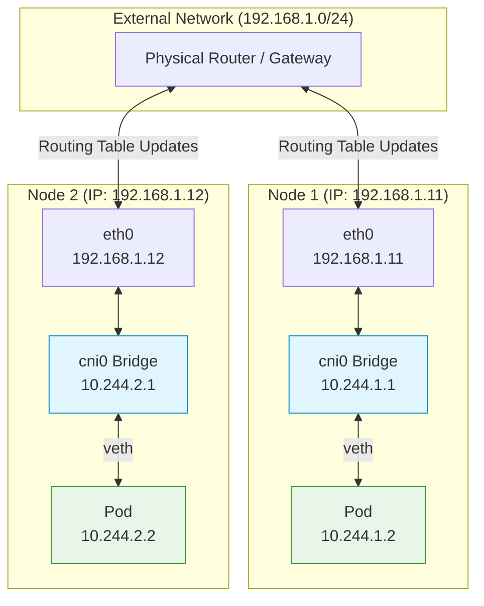

# Pod Networking Concepts

Before deploying applications, you must ensure that your Kubernetes cluster has a working **Pod Networking** solution. Kubernetes does not come with a built-in solution for this; instead, it expects you to implement a third-party networking plugin (a CNI plugin) that meets its strict requirements.

---

## 📋 1. The Kubernetes Pod Networking Requirements

Kubernetes has a very clear set of rules for how Pod networking must behave. Any CNI solution you choose must satisfy these conditions:

1. **Every Pod gets its own unique IP address**.
2. **Every Pod must be able to communicate with every other Pod on the same node** using that IP address.
3. **Every Pod must be able to communicate with every other Pod on *other* nodes** using that IP address, **without NAT** (Network Address Translation).

Kubernetes doesn't care exactly *how* you implement this (which IP range you use, what kind of bridging you employ), as long as those rules are obeyed.

---

## 🛠️ 2. Building a Custom Pod Network (A Thought Experiment)

To understand how popular CNI plugins (like Flannel, Calico, or Weave) work, let's look at how we would build a solution manually across a 3-node cluster.

### Pod Networking Architecture

### Step 1: Define the Subnets
Imagine we have three nodes on an external network (`192.168.1.11`, `.12`, and `.13`). 

First, we assign a unique, non-overlapping subnet to each node for its internal Pods. For example:
*   **Node 1**: `10.244.1.0/24`
*   **Node 2**: `10.244.2.0/24`
*   **Node 3**: `10.244.3.0/24`

*(Together, they form a single large cluster network of `10.244.0.0/16`)*.

### Step 2: The Bridge Configuration
On each node, we create a Linux Bridge (e.g., `cni0`). We assign the bridge an IP address from that node's assigned subnet (e.g., `10.244.1.1` for Node 1). 

### Step 3: The CNI Script (Pod Creation)
When a container is created, Kubernetes needs to attach it to this bridge. We would write a script that performs the following steps:
1.  Use `ip link add` to create a `veth` pair.
2.  Attach one end to the container's network namespace and the other end to the bridge.
3.  Assign a free IP address from the node's subnet to the container.
4.  Add a default route in the container pointing to the bridge IP (`10.244.x.1`).
5.  Bring the interfaces `up`.

This satisfies Requirements 1 & 2 (Pods on the same node can talk).

### Step 4: Routing Between Nodes
Right now, a Pod on Node 1 (`10.244.1.2`) cannot ping a Pod on Node 2 (`10.244.2.2`). Node 1 doesn't know where the `10.244.2.0/24` network is.

To solve this, we must configure **routing**. 
*   On Node 1, we add a route: "To reach `10.244.2.0/24`, send traffic via `192.168.1.12` (Node 2's IP)".
*   In larger environments, instead of configuring routes on every single node, a better solution is to configure these routes on your physical network Router, pointing traffic for specific `10.244.x.x` ranges to the correct Kubernetes node.

This satisfies Requirement 3 (Pods on different nodes can talk).

---

## 🤖 3. How Kubernetes Automates This (The CNI Standard)

We don't want to run our custom script manually every time a Pod spins up. We need Kubernetes to do it automatically. 

This is where the **CNI (Container Network Interface)** comes in as the middleman.

1.  We modify our script to accept standard CNI commands (`ADD`, `DEL`).
2.  We place our script in the CNI binary directory (usually `/opt/cni/bin/`).
3.  We provide a configuration file telling Kubernetes to use our script.
4.  When the container runtime (e.g., containerd) spins up the "Pause" container for a new Pod, it automatically invokes our CNI script with the `ADD` command, passing the namespace ID.
5.  Our script executes the `veth` and IP assignment logic instantly.

*Note: In the real world, instead of writing this script yourself, you simply install a daemonset (like Flannel) that handles all the bridging, IP allocation, and routing updates automatically across all nodes!*
