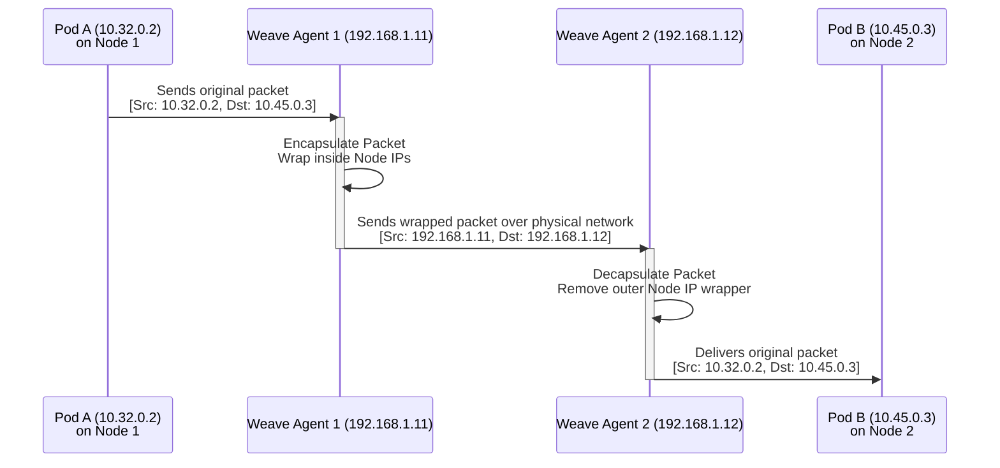

# Weaveworks CNI Plugin

In the previous sections, we looked at how to manually build a Pod network using bridges, `veth` pairs, and static routing tables. However, in a cluster with hundreds of nodes and thousands of Pods, managing a manual routing table across physical routers becomes practically impossible.

To solve this, we rely on advanced CNI plugins like **Weaveworks (Weave Net)** to handle the complexity for us.

---

## 📦 1. The "Shipping Agent" Analogy

To understand how Weave works, think of the Kubernetes cluster as a large international company, the nodes as different office sites, and the Pods as individual employees.

1.  **The Old Way (Manual Routing)**: An employee (Pod A) gives a package to the office boy (the Node's routing table) and says, "Take this to Employee B at Site 3." The office boy has to get in a car, figure out the GPS coordinates, and drive across the country. This doesn't scale.
2.  **The Weave Way (Outsourcing to a Shipping Company)**: You hire a shipping company (Weave). They place a dedicated **Shipping Agent (Weave Peer)** at every single office site. 
    *   The agents all talk to each other constantly. They know exactly who works at which site.
    *   Employee A gives the package to their local agent. 
    *   The agent looks at the destination, packs the small envelope into a giant, secure shipping crate (with the address of the remote agent on the outside), and puts it on an airplane. 
    *   The remote agent receives the crate, opens it up, pulls out the small envelope, and hands it locally to Employee B.

---

## 🕸️ 2. How Weave Works Technically (Encapsulation)

In computer networking, the "shipping crate" concept is called **Encapsulation**.

1.  **Weave Peers**: When Weave is deployed, it places an agent (a peer) on every single node. These peers constantly communicate to share an entire topology map of the cluster. Every agent knows exactly where every Pod IP lives.
2.  **The Weave Bridge**: Weave creates its own bridge on the node (typically named `weave`) and connects Pods to it. 
3.  **Encapsulation**: 
    *   When Pod A (on Node 1) pings Pod B (on Node 2), the packet hits the local Weave agent.
    *   The agent sees the destination is on another node. 
    *   It takes the entire original packet (Source: Pod A IP, Dest: Pod B IP) and wraps it inside a **brand new packet**. 
    *   This outer packet has the source IP of *Node 1* and the destination IP of *Node 2*.
4.  **Decapsulation**: 
    *   The packet travels across the physical network cleanly (because switches just see standard Node-to-Node traffic).
    *   The Weave agent on Node 2 intercepts the packet, rips off the outer wrapper, and delivers the original internal packet to Pod B.

### Weave Encapsulation Architecture



---

## 🚀 3. Deploying Weave in Kubernetes

Because Weave requires an agent to exist on every single node in the cluster, the perfect Kubernetes resource for deploying it is a **DaemonSet**. A DaemonSet ensures that exactly one replica of a Pod runs on every single node.

### Deployment Method
Usually, deploying Weave (or any CNI) is as simple as running a single `kubectl apply` command against the vendor's manifest URL:

```bash
kubectl apply -f "https://cloud.weave.works/k8s/net?k8s-version=$(kubectl version | base64 | tr -d '\n')"
```
*(Note: As discussed in the CNI Introduction, you do not need to memorize this URL for the exam. Ensure you follow whatever link the exam question provides).*

### Verification and Troubleshooting
Once deployed, particularly if you bootstrapped your cluster with `kubeadm`, you will see the Weave peers running as Pods in the `kube-system` namespace.

If there is a networking issue between pods, viewing the logs of the Weave DaemonSet pods on the affected nodes is the best place to start:

```bash
# Find the Weave pods
kubectl get pods -n kube-system -l name=weave-net -o wide

# View the logs of a specific Weave peer to check for topology/encapsulation errors
kubectl logs -n kube-system <weave-pod-name> -c weave
```
