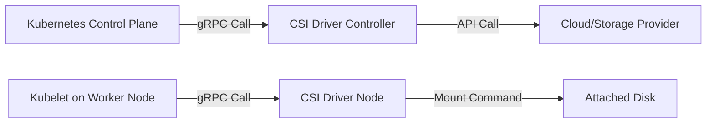

# Container Orchestrator & Storage (CSI) Workflow

Understanding the relationship between the **Container Orchestrator** (Kubernetes) and the **Storage Driver** (CSI) is key to mastering stateful workloads. 

---

## 🏗️ 1. The Relationship: The "Translator" Model

In older versions of Kubernetes, storage drivers were "in-tree" (built directly into the K8s binary). This was slow and hard to maintain. Today, Kubernetes uses the **Container Storage Interface (CSI)**.

### The Actors 🎭
1.  **Orchestrator (Kubernetes)**: The "Manager". It knows *when* a Pod needs storage but doesn't know *how* to talk to a specific disk (like an AWS EBS or an NFS share).
2.  **CSI Driver**: The "Translator". It is a plugin that speaks "Kubernetes" on one side and the "Storage Provider's API" on the other. 
3.  **Storage Provider**: The "Infrastructure". The actual physical or virtual disk located in your cloud or data center.

### Interaction Flow

---

## 🔄 2. Step-by-Step: How a Volume is Born

When a user creates a PVC, a complex orchestration of events occurs to get that disk into a container.

### Phase 1: Provisioning (The Request)
1.  **User creates a PVC**: A user submits a YAML file requesting 10GB of storage.
2.  **External Provisioner (Watcher)**: A CSI sidecar container (the Provisioner) watches for new PVCs and sees the request.
3.  **CreateVolume RPC**: The Provisioner sends a `CreateVolume` request to the **CSI Driver**.
4.  **Cloud API Call**: The CSI Driver calls the Storage Provider API (e.g., AWS CreateVolume) to create the physical disk.
5.  **PV Creation**: Kubernetes automatically creates a **PersistentVolume (PV)** object and binds it to the **PVC**.

### Phase 2: Attaching (The Connection)
6.  **Pod Scheduling**: A Pod is created and references the PVC. The Scheduler places the Pod on **Node-A**.
7.  **External Attacher**: Another CSI sidecar (the Attacher) sees that the volume needs to be attached to **Node-A**.
8.  **ControllerPublishVolume RPC**: The Attacher calls the CSI Driver to "Publish" (Attach) the volume.
9.  **Storage Provider Attach**: The Driver tells the Cloud Provider to attach the disk to the virtual machine (Node-A).

### Phase 3: Mounting (The Hand-off)
10. **Kubelet Recognition**: The Kubelet on **Node-A** sees that a volume is attached but not yet usable.
11. **NodeStageVolume**: The Kubelet calls the CSI Driver on that specific node to format the disk (e.g., ext4) and prepare a "staging" mount point.
12. **NodePublishVolume**: The Kubelet calls the CSI Driver for the final mount. The volume is mounted from the node's host path into the **Pod's container**.

---

## ⚡ 3. Summary of CSI Sidecars

Kubernetes uses these helper containers (Sidecars) to bridge the gap between K8s and the CSI Driver:

*   **external-provisioner**: Watches PVCs $\rightarrow$ Creates/Deletes volumes.
*   **external-attacher**: Watches Pods $\rightarrow$ Attaches/Detaches volumes to nodes.
*   **external-resizer**: Watches PVC size changes $\rightarrow$ Expands volumes.
*   **node-driver-registrar**: Registers the CSI driver with the Kubelet on each node.

---

> [!TIP]
> **CKA Insight**: In the exam, if a Volume isn't mounting, check the **CSI Driver Pods** (usually in `kube-system` or a dedicated namespace). If the driver is dead, the "Provisioning" and "Attaching" logic will fail even if the Cloud Provider is healthy!
