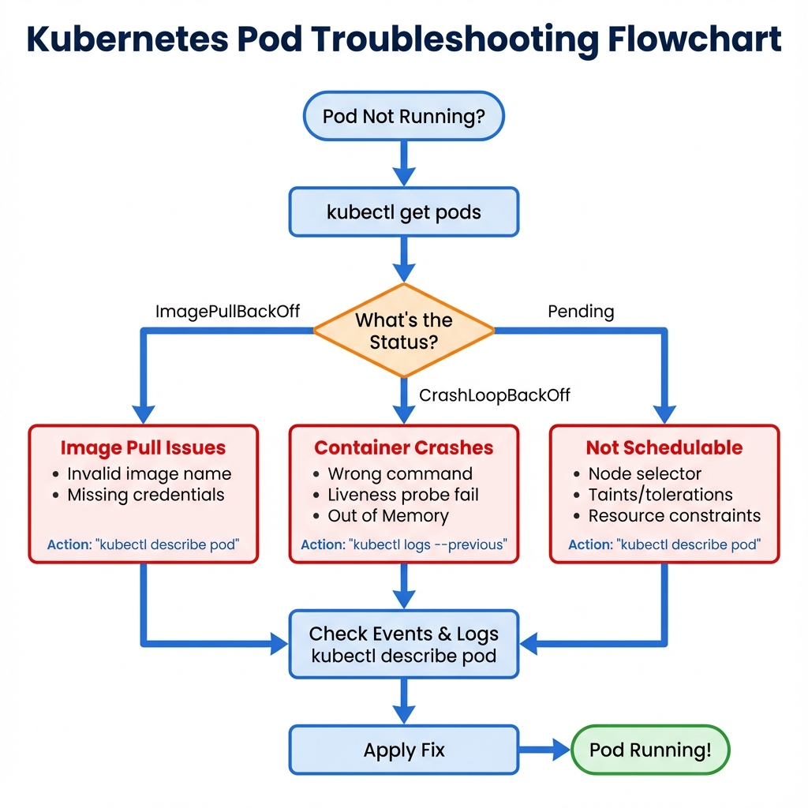

# Kubernetes Troubleshooting Flowchart

This flowchart provides a systematic approach to troubleshooting common Kubernetes issues.

## How to Use This Flowchart

1. Start with identifying the pod status
2. Follow the decision tree based on the error symptoms
3. Apply the recommended fixes for each scenario
4. Verify the resolution with kubectl commands

## Quick Reference

- **ImagePullBackOff**: Check image name, registry credentials
- **CrashLoopBackOff**: Check logs, liveness probes, resource limits
- **Pending**: Check node resources, taints, affinity rules
- **ContainerCreating**: Check PVC status, network plugins